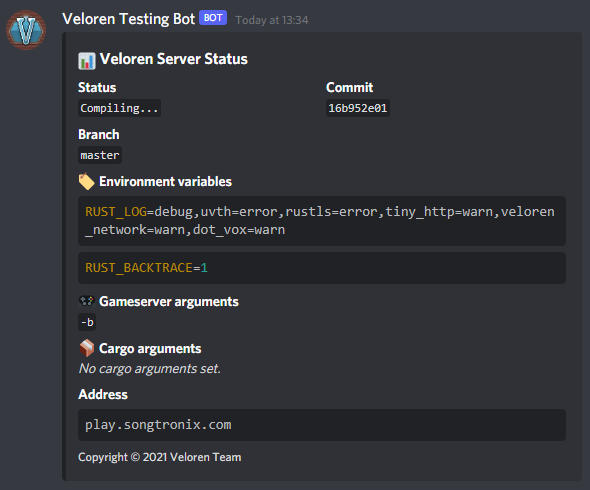

# Veloren Server Bot

Discord bot to control a git based veloren server.

## Using

1. Create an discord application [here](https://discord.com/developers/applications).
2. Under the bot section enable it and copy the token.
3. On the server setup a folder with the [docker-compose.yml](https://github.com/Songtronix/veloren-server-bot/blob/master/docker-compose.yml)
4. Replace the `build: .` directive with the image you want to use. 
5. Start the bot via `docker-compose up` and let it create the settings.
6. Adjust all values in `settings.yaml` as desired.
7. Start again.
8. DM the bot with `~register` as the owner of the discord bot and register the slash commands globally.
9. Bot is ready. If you want to have live logs follow the next steps.
10. Setup an reverse proxy like caddy/nginx.
11. Setup password based access (do not leak server logs publically) to the frontail container (forward to 9001).
12. Logs should now be accessible.

## Features
- Git based (deploy branches or commits)
- Live logs (based on frontail)
- Configure Environment variables, Gameserver and cargo arguments
- View, update, delete veloren configuration and download the server database (keep in mind discords upload limits)

# Security

Only allow trusted members to access it as the bot allows arbitrary code execution as long as they have push rights to the codebase and the server run in the same container as the bot itself.

## Contributing

Please see the [CONTRIBUTING.md](CONTRIBUTING.md) file for more details.

[CONTRIBUTING.md]: CONTRIBUTING.md

## License

Veloren Server Bot is licensed under either of

* Apache License, Version 2.0, ([LICENSE-APACHE](LICENSE-APACHE) or
  <http://www.apache.org/licenses/LICENSE-2.0>)
* MIT license ([LICENSE-MIT](LICENSE-MIT) or
  <http://opensource.org/licenses/MIT>)

at your option.

Unless you explicitly state otherwise, any contribution intentionally submitted
for inclusion by you, as defined in the Apache-2.0 license, shall be
dually licensed as above, without any additional terms or conditions.
